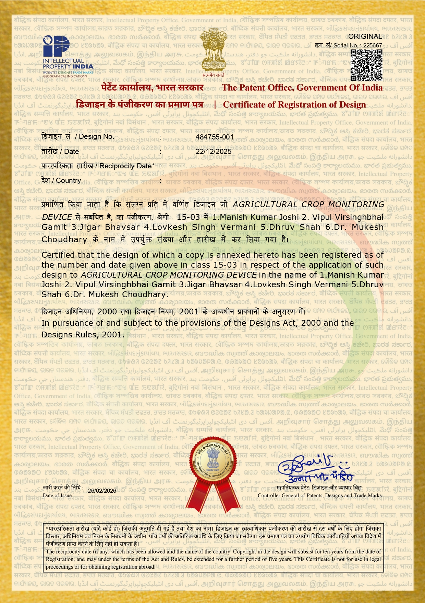

# 🌱 Agricultural Crop Monitoring Device

---

# Overview

This registered design presents an innovative **Agricultural Crop Monitoring Device** developed to support modern precision agriculture. The design focuses on improving crop monitoring through intelligent sensing and data-driven observation.

---

# Patent Information

| Item | Details |
|------|---------|
| Design Title | Agricultural Crop Monitoring Device |
| Registration Type | Design Registration |
| Registration Number | 484755-001 |
| Registration Date | 22 December 2025 |
| Certificate Date | 26 June 2026 |
| Status | Granted |
| Country | India |

---

# Research Domain

- Smart Agriculture
- Precision Farming
- IoT
- Crop Monitoring
- Intelligent Devices

---

# Applications

- Precision Agriculture
- Smart Farming
- Crop Health Monitoring
- Agricultural Automation
- Research and Development

---

# Innovation Highlights

- Modern monitoring device design
- Supports intelligent agriculture
- Suitable for precision farming
- Encourages digital transformation in agriculture

---

# Gallery

  

---

# Downloads

- Patent Certificate
- Patent Documents

---

© Intellectual Property India
