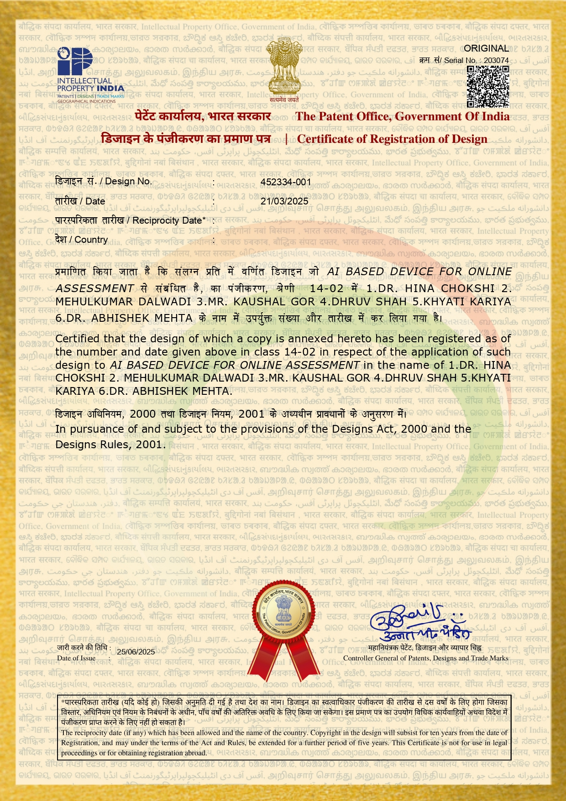

# 🤖 AI Based Device for Online Assessment

---

# Overview

This registered design introduces an **AI Based Device for Online Assessment**, designed to enhance digital examination environments through Artificial Intelligence-assisted assessment mechanisms.

---

# Patent Information

| Item | Details |
|------|---------|
| Design Title | AI Based Device for Online Assessment |
| Registration Type | Design Registration |
| Registration Number | 452334-001 |
| Registration Date | 21 March 2025 |
| Certificate Date | 25 June 2025 |
| Status | Granted |
| Country | India |

---

# Research Domain

- Artificial Intelligence
- Educational Technology
- Digital Learning
- Smart Assessment
- AI Systems

---

# Applications

- Online Examinations
- AI Assisted Assessment
- Educational Institutions
- Universities
- Skill Evaluation Platforms

---

# Innovation Highlights

- AI-enabled assessment platform
- Supports intelligent examination systems
- Digital evaluation workflow
- Future-ready educational infrastructure

---

# Gallery

---

# Downloads

- Patent Certificate
- Patent Documents

---

© Intellectual Property India
