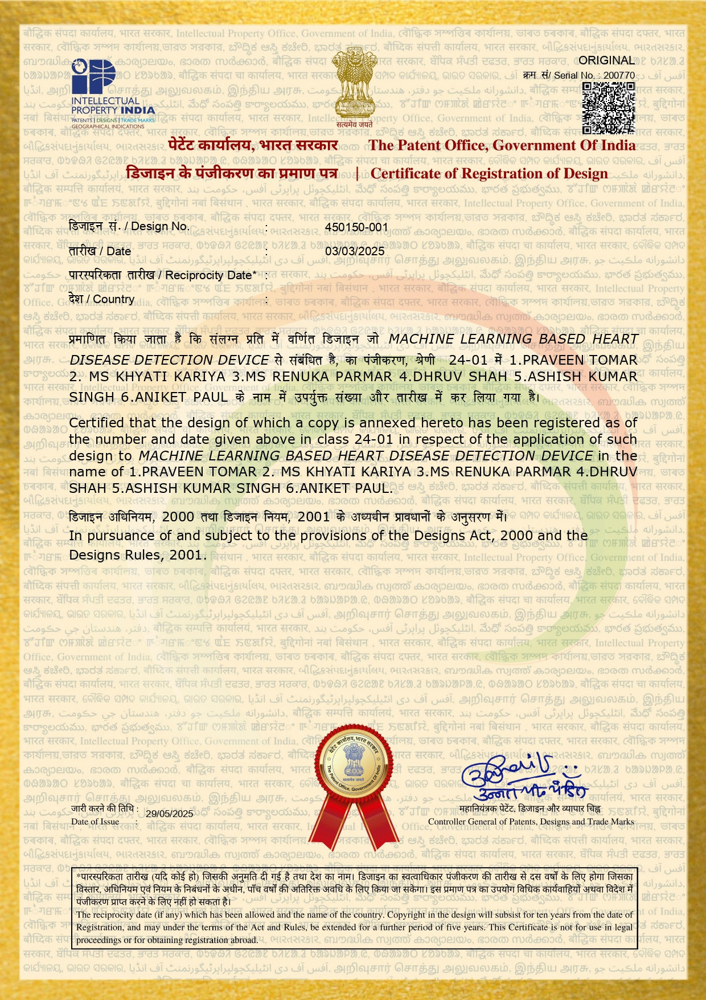

# ❤️ Machine Learning Based Heart Disease Detection Device
---

# 📖 Overview

This registered design patent presents a **Machine Learning Based Heart Disease Detection Device**, designed to assist healthcare professionals in the early identification and assessment of cardiovascular diseases using intelligent machine learning techniques.

The innovation combines medical diagnostics with artificial intelligence to improve disease prediction, support clinical decision-making, and promote preventive healthcare through technology-driven solutions.

---

# 📌 Patent Details

| Item | Details |
|------|---------|
| **Patent Title** | Machine Learning Based Heart Disease Detection Device |
| **Design Number** | 450150-001 |
| **Patent Type** | Design Registration |
| **Registration Authority** | The Patent Office, Government of India |
| **Registration Date** | 03 March 2025 |
| **Certificate Issued** | 29 May 2025 |
| **Country** | India |

---

# 👨‍🔬 Inventors

- Praveen Tomar
- Khyati Kariya
- Ms. Renuka Parmar
- **Dhruv Shah**
- Ashish Kumar Singh
- Aniket Paul

---

# 💡 Innovation Highlights

- Machine Learning assisted medical diagnosis.
- Intelligent heart disease prediction framework.
- AI-driven healthcare support system.
- Early risk identification methodology.
- Smart clinical decision support.
- Technology-enabled preventive healthcare.

---

# 🎯 Potential Applications

- Hospitals
- Diagnostic Centers
- Smart Healthcare Systems
- Medical Research
- Telemedicine Platforms
- Preventive Healthcare Programs
- AI-enabled Clinical Decision Support Systems

---

# 🛠 Research Domains

- Artificial Intelligence
- Machine Learning
- Healthcare Analytics
- Medical Informatics
- Predictive Analytics
- Digital Healthcare

---

# 🧠 Technologies Involved

- Machine Learning
- Predictive Analytics
- Healthcare AI
- Medical Decision Support
- Intelligent Diagnostic Systems

---

# 🏆 Contribution

As one of the inventors, I contributed to the development of this innovative healthcare-oriented design that integrates intelligent computational approaches with medical diagnosis. The work demonstrates the application of Artificial Intelligence in improving healthcare accessibility, diagnostic support, and technology-driven medical innovation.

---

# 🖼 Gallery

  

---

# 📜 Citation

**Machine Learning Based Heart Disease Detection Device**, Certificate of Registration of Design, Design No. **450150-001**, The Patent Office, Government of India, Registered on **03 March 2025**.

---

> *This repository documents one of my registered intellectual property contributions in the field of Artificial Intelligence and Healthcare Technology.*
